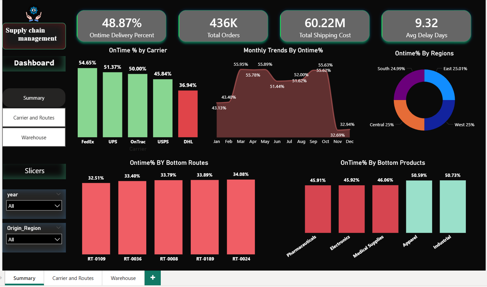
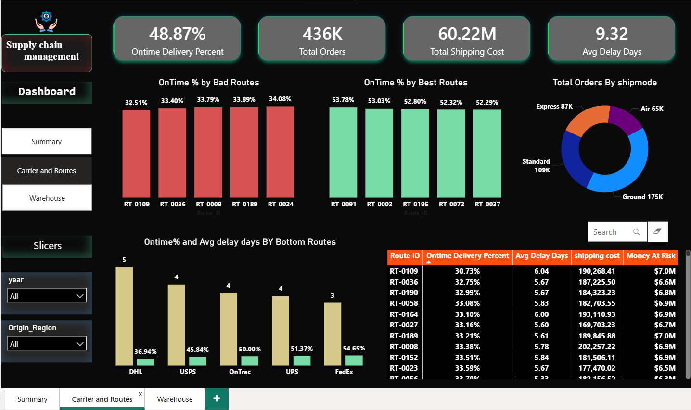
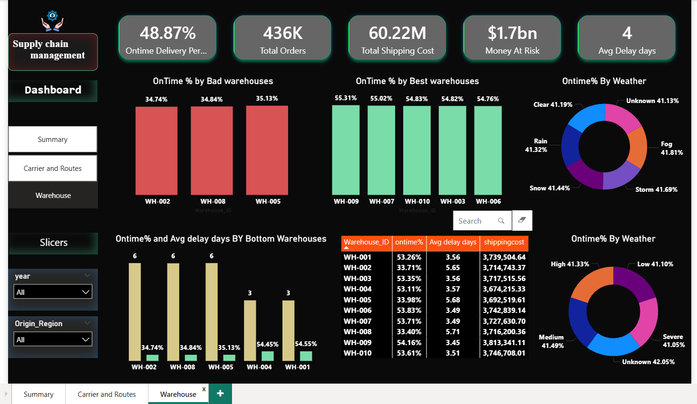

# 🚚 SwiftChain Logistics — Supply Chain Delivery Intelligence System

## 📌 Project Overview
SwiftChain Logistics Inc. is a US-based third-party logistics company 
managing 436K shipments across 200 routes, 10 warehouses, and 5 carrier 
partners. Their on-time delivery rate had dropped to 48.87% — far below 
the industry benchmark of 85%. This project identifies the root causes 
of delivery delays and provides actionable recommendations through 
Python EDA, SQL analysis, and a Power BI dashboard.

---

## 🔗 Live Dashboard
👉 [View Power BI Dashboard](https://app.powerbi.com/links/xdgzc432vK?ctid=035ddef6-2433-48b6-8526-70ca8181f76d&pbi_source=linkShare)

---

## 🛠️ Tools Used
| Tool | Purpose |
|------|---------|
| Python (Pandas, Matplotlib, Seaborn) | Data cleaning and EDA |
| MySQL | KPI queries and SQL analysis |
| Power BI | Interactive 3-page dashboard |
| DAX | Custom measures and KPIs |
| Git & GitHub | Version control |

---

## 📊 Dashboard Pages
### Page 1 — Executive Summary
- On-Time Delivery Rate, Total Orders, Shipping Cost, Avg Delay Days
- Monthly delay trends showing Nov-Dec spike
- Carrier performance comparison
- Bottom routes and product categories

### Page 2 — Carrier and Routes
- Top 5 worst and best performing routes
- Carrier on-time rate comparison
- Avg delay days by carrier
- Ship mode performance

### Page 3 — Warehouse and Root Cause
- Worst and best performing warehouses
- $1.7bn order value at risk
- Weather and traffic impact on delays
- Detailed warehouse performance table

---

## 🔍 Key Findings
- ❌ On-time rate is **48.87%** vs **85%** industry benchmark
- 🚛 **DHL** is the worst carrier at only **36.94%** on-time rate
- 🏭 **WH-002, WH-008, WH-005** are responsible for majority of severe delays
- 💰 **$1.7 billion** order value is at risk due to delays
- 📅 **November and December** have 60% higher delay rates than rest of year
- 🌧️ **Storm weather** adds average 5 extra delay days
- 💊 **Pharmaceuticals and Electronics** have the highest delay rates
- 🛣️ **RT-0109** is the worst performing route at 32.51% on-time rate

---

## 💡 Recommendations
- **DHL contract review** — renegotiate SLA or replace with better carrier
- **WH-002, WH-005, WH-008 process overhaul** — investigate staffing and processes
- **Q4 capacity planning** — increase resources in November and December
- **Weather-based routing** — avoid storm-prone routes during bad weather
- **Priority handling** — SLA upgrades for Pharmaceuticals and Electronics
- **Route optimization** — retire or redesign the 20 worst performing routes

---

## 📁 Project Structure
```
SUPPLY_CHAIN_MANAGEMENT/
│
├── Documents/
│   ├── Data_dict_meta_data.xlsx
│   └── SwiftChain_Project_Brief.pdf
│
├── O_Raw_Data/
│   ├── swiftchain_logistics_450k.csv
│   ├── delivery_delayed.csv
│   ├── Ontime_delivered.csv
│   └── Transit.csv
│
├── power bi/
│   ├── power_in/
│   │   ├── fact_table.csv
│   │   ├── dim_carriers.csv
│   │   ├── dim_customers.csv
│   │   ├── dim_destination.csv
│   │   ├── dim_origins.csv
│   │   ├── dim_products_cat.csv
│   │   ├── dim_routes.csv
│   │   ├── dim_segment_cust.csv
│   │   └── dim_warehouses.csv
│   └── power_out/
│       └── supplychain.pbix
│
├── python/
│   ├── python_notebook/
│   └── python_output/
│
├── Screenshots/
│   ├── page1-summary.png
│   ├── page2-carrier and routes.png
│   └── page3-warehouses.png
│
├── sql/supplychain.sql
│
└── README.md
```


---

## 📸 Dashboard Screenshots
### Page 1 — Executive Summary


### Page 2 — Carrier and Routes


### Page 3 — Warehouse and Root Cause


---

## 👤 Author
**Chandu**
- GitHub: [@Chandu951513](https://github.com/Chandu951513)

---

## 📃 License
This project is for portfolio and educational purposes only.
SwiftChain Logistics Inc. is a fictional company created for this analysis.
